## SAP Data Hub Visualization

I would change the well-known phrase and say:
> “An **animated** picture is worth a **million** words”. 

And, because of that, the animated image below shows the result of this blog post. Later we will go into prerequisites and steps needed to achieve it.

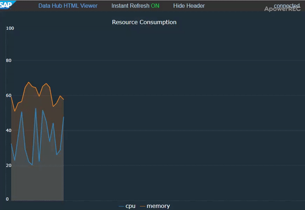
<p align="center"></p>

*More **visual** examples at the end of the blog.*

### Introduction and Prerequisites

I believe that everyone interested in this topic (blog) is already familiar with SAP Data Hub, so special introduction is not necessary. In any case,I would recommend the following links if someone is just starting:
- https://blogs.sap.com/2017/12/06/sap-data-hub-developer-edition/
- https://blogs.sap.com/2018/04/26/sap-data-hub-trial-edition/

I personally use **developer edition** and run Data Hub as a docker container on my local machine. All examples are created and tested using this edition, but they (should) work also on any other environment since they use only very basic functionalities of Data Hub.

### Problem

I find Data Hub as a great tool to orchestrate and manage especially IoT sensor data. When it comes to IoT data. I am more/less focused on one goal with this tool: to extract the meaningful information. For that purpose, I usually create operators (Javascript, Python, …) that enrich or filter raw data. In this whole process I have to debug my pipeline and for that I usually use well known **Terminal** operator.

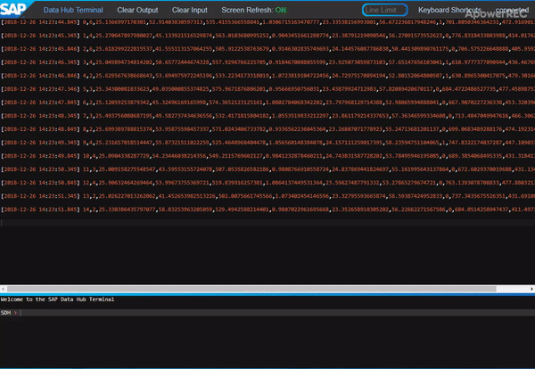

Unfortunately, **Terminal** is not so user friendly and it is not always easy to find specific “line” or specific “value”. If I want to monitor single or multiple sensor values, it would be impossible with this console view.

### Solution

For me, the ideal replacement for **Terminal** operator would be something that we can call Chart Operator which will graphically visualize sensor data in real time. For that purpose, I found operator called **HTML Viewer** which shows any html received on input port.

But where to find the details about **HTML Viewer**? If you go to Data Hub Modeler and search for **HTML Viewer**, you will see the description:

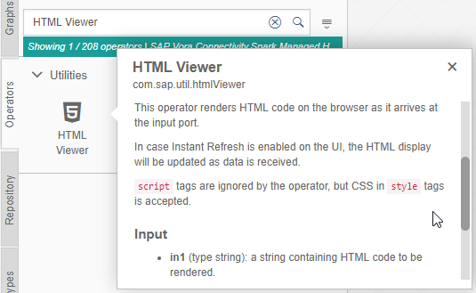

Here, I would like to highlight the comment which says that ```script``` tags will be ignored. It means that we are not able to generate some Javascript code as part of HTML because this operator will just ignore it.

*I suppose that we are all a little bit familiar with Javascript and know that it is responsible for fancy charts available today. It means that this **Javascript discarding** will make our lives harder 🙂*

In other words, we would have to generate pure HTML and CSS code which will be visible as part of **HTML Viewer**, but with provided **Instant Refresh** functionality we could achieve continuous updates of our charts.

In next part of the blog, we will go though step-by-step process and create simple pipeline which starts with **Data Generator** and ends with **HTML Viewer**.

### Step by Step

#### 1 - Data Generator Operators

First we will create two **Data Generator** operators. They will simulate the streaming from two sensors. For simplicity, they will just generate random value in specified range and propagate it further.
1) Select **Operators** bar on the left
2) Search for keyword **Generator**. Operators are automatically filtered and probably the first one is **Data Generator**
3) Drag and drop the operator to the white space on your diagram
4) Repeat the step 3. Your diagram should be as in image below. We need two generators because we will have two values (sensors) in our chart display.
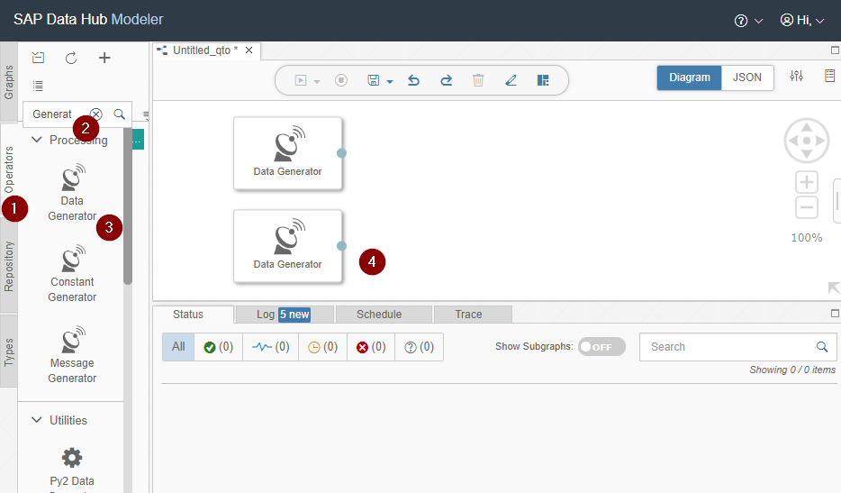

#### 2 - Data Generator Code

1) Left click on first component to show the options. They are visible on the right side of component
2) Click on the first one, which will open the **script** in new tab (Data Hub tab, not browser tab)

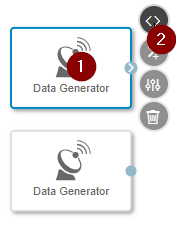

3) Replace the generated code with the content:

```javascript
getRandom = function(min, max) {
    return Math.random() * (max - min) + min;
};
generateData = function() {
    var payload = getRandom(20,60);     // Random value between 20 and 60 
    return payload;
};
$.addTimer("500ms",doTick);             // Generate random value every 500ms
function doTick(ctx) {
    $.output(generateData());
}​
``` 
The script above will generate new random value in range [20,60] every 500ms. This will the first input in our visualization graph.

4) Repeat the same steps for the second Generator. But this time, **generateData()** could produce the value between 50 and 70. For example:
```javascript
getRandom = function(min, max) {
    return Math.random() * (max - min) + min;
};
generateData = function() {
    var payload = getRandom(50,70);     // Generate random number between 50 and 70
    return payload;
};​
$.addTimer("500ms",doTick);             // Generate random value every 500ms
function doTick(ctx) {
    $.output(generateData());
}​
```
### 3 - HTML Generator

This step is the main one in this blog.

We will create new **Python3Operator** which will accept two inputs every 500 ms (from two Generators) and produce single HTML string. Then we will forward this HTML string into **HTML Viewer**, the component responsible for displaying.

*Why Python? No special reason, it can be any other language that can produce HTML string.*

The key point is that newly generated HTML will be just update of the previously generated HTML. With this, everyone will see the final HTML as animation (like with Javascript).

1) Type **Python3** in search bar to find the required operator *It is important that you choose Python3 and not Python2. Code example that we will use works with Python3.*
2) Drag and drop **Python3Operator** to the white space
3) Place it just right to the previously created **Data Generator**s
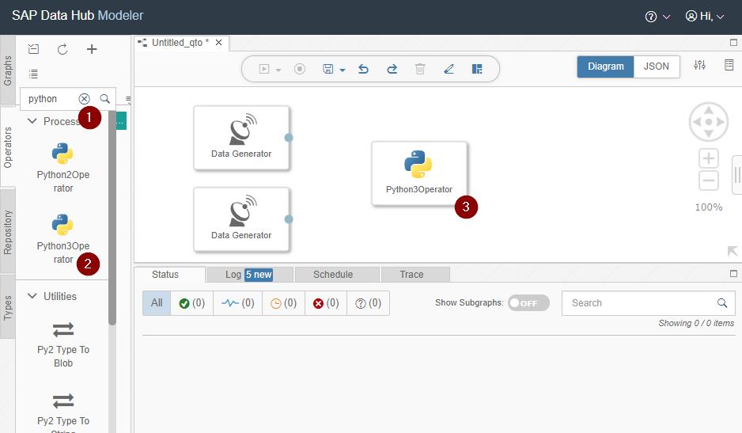

Next, create two input ports and connect them with **Data Generator**s:

4) Left click on newly created operator and you will see the options on the right
5) Choose the second option: **Add Port**
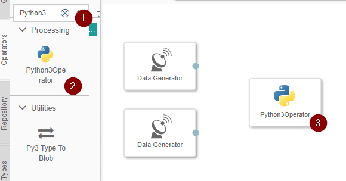

New window will be displayed. Populate it as in the image bellow. Click **OK**.

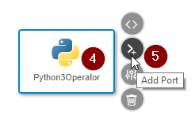

Now, you have created new **input** port on **Python3Operator**. Create two more ports (one input and output) with the following attributes:

- Second Port:
    - Name: input2
    - Type: string
    - Input
- Third Port:
    - Name: output
    - Type: string
    - Output

*Note: Names **input1**, **input2**, **output** will be used in the code inside operator.*

Your operator should look like in the image below.

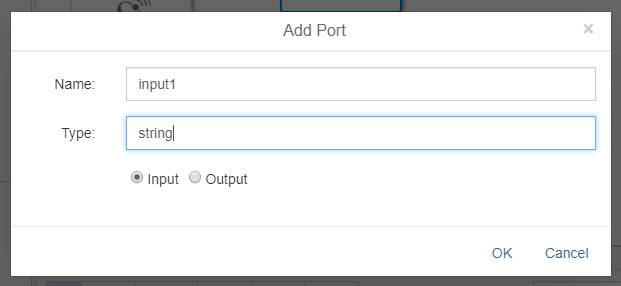

Now, when input and output ports are created, we will add the logic (python code) inside operator. Left click on your operator and choose the first option: **Script**. New tab will be opened with commented python code. You can delete everything from this code editor and replace with the code bellow. I know, it is long, but you could only be focused on the first section called **Configuration**.

As you can see, the port names matches the values in configuration. For now, you can leave everything as is, but later you can experiment with different configuration values.

Additionally, I will explain the main concept behind this script just after we start our pipeline.

```python
# CONFIGURATION
# --------------------------------------------------------------------------------------------
y_min = 0                           # minimum value displayed on y axis
y_max = 100                         # maximum value displayed on y axis (maximum must be greater (not greater or equal) than minimum)
inputs = ["input1","input2"]        # name of the input ports
output = "output"                   # name of the output port 
chart_colors = ["#2E86C1","#E67E22"]# chart colors. First element in chart_colors array matches the first value in inputs array. blue = 2E86C1 , yellow = F4D03F, orange = E67E22
x_step = 10                         # distance in pixels on x axis between two consecutive values/measures (movement/shift ti the right)
chart_height = 500                  # height of the chart in pixels 
chart_width = 1500                  # width of the chart in pixel
num_y_labels = 4                    # number of labels dispyed on y axes. y_min and y_max values are displayed by default on y axis. Total number of labels is num_y_labels + 2 
y_label_decimals = 0                # number of decimal places used for displaying labels on y axis - 0 means, integers are displayed
graph_name = "Resource Consumption" # title/graph name
input_names = ["cpu", "memory"]     # 
# -------------------------------------------------------------------------------------------

# INTERNAL CONFIGURATION - CHANGE ONLY IF YOU KNOW WHAT ARE YOU DOING
# ------------------------------------------------------------------------------------------
x_zero = 15                         # chart line starts from x_zero position. it is a shift left on the chart for y axis labels
font_size = 12                      # font size
background_color = "#212F3C"        # dark blue
# ------------------------------------------------------------------------------------------

# INTERNAL CONFIGURATION - DO NOT CHANGE
# -------------------------------------------------------------------------------------------
x_last_1 = None                       # x coordinate of last drawn point, in pixels. Depends on x_step value.
y_last_1 = None                       # y coordinate of last drawn point, in pixels
x_last_2 = None
x_last_2 = None

y_range = y_max - y_min             # range of values calculated from configuration parameters.
font_size_px = font_size * 0.6667   # font size in pixels, important for indentation on y axis
y_label_pattern = "{0:."+str(y_label_decimals)+"f}"     # pattern which is used to format values on y axis


# HTML TEMPLATES
# ------------------------------------------------------------------------------------------
html = '''
<style>
  body, html { height: 100%; background-color: '''+background_color+''';}
  .graph-container { width: 90%; height: 90%; position: relative; padding-left: 20px; padding-top: 20px }
  .chart { background: '''+background_color+'''; width: '''+str(chart_width)+'''px; height: '''+str(chart_height)+'''px; border-left: 1px dotted #555; border-bottom: 1px dotted #555; }
</style>
<div class="graph-container"> 
  <div align="center" ><font face="verdana" color="white">'''+graph_name+'''</font></div>     
  <div class="chart-box">
    <svg viewBox="0 0 '''+str(chart_width)+''' '''+str(chart_height)+'''" class="chart">
        
        <text font-family="verdana" font-size="'''+str(font_size)+'''" fill="white" y="'''+str(chart_height)+'''" >'''+ y_label_pattern.format(y_min)+'''</text>
        <text font-family="verdana" font-size="'''+str(font_size)+'''" fill="white" y="'''+str(font_size)+'''" >'''+ y_label_pattern.format(y_max)+'''</text>
        #y_labels   

        <polygon fill="'''+chart_colors[0]+'''" stroke="none" stroke-width="4" fill-opacity="0.2" points="#fill_1" />
        <polygon fill="'''+chart_colors[1]+'''" stroke="none" stroke-width="4" fill-opacity="0.2" points="#fill_2" />
        
        #points_1
        #points_2
        
    </svg>
        <div align="center" >
        <font color="'''+chart_colors[0]+'''" font-size="24px">―</font>
        <font face="verdana" color="white">'''+input_names[0]+'''</font>&ensp;
        <font color="'''+chart_colors[1]+'''" font-size="24px">―</font>
        <font face="verdana" color="white">'''+input_names[1]+'''</font>
        </div>
  </div>
</div>
'''

point = '''
<polyline fill="none" stroke="#chart_color" stroke-width="2"
    points="#x_start, #y_start, #x_end, #y_end"/>
'''

horizontal_line = '''
<polyline fill="none" stroke="#989898" stroke-width="0.3" points=" '''+str(x_zero)+''', #y_pos, '''+str(chart_width)+''', #y_pos "/>
'''

y_axis_text = '''
<text font-family="verdana" font-size="'''+str(font_size)+'''px" fill="white" y="#y_pos" >#y_value</text>
'''
# ------------------------------------------------------------------------------------------


# DRAWING CODE
# ------------------------------------------------------------------------------------------
points_1 = ""
points_2 = ""
fill_start_1 = "#x_start,"+str(chart_height)+","
fill_start_2 = "#x_start,"+str(chart_height)+","
fill_row = "#x_start,#y_start,#x_end,#y_end,"
fill_end = "#x_last,"+str(chart_height)
fill_1 = ""
fill_2 = ""

# calculate y value for input value. Input value is received from input port and must be integer or float. 
# input: value (float or integer)
# return: y value in pixels (integer)
def calculate_y(value):
    global y_range
    
    y_relative = (value - y_min) / y_range
    y_absolute = y_relative * chart_height
    y = chart_height - y_absolute
    return y

# create html which draws horizontal axis and corresponding values
def create_y_labels_html(num_y_labels):
    global y_min
    global y_max
    global y_range
    
    html_labels = ""
    if (num_y_labels <= 0):
        return html_labels;
    n_y_steps = num_y_labels + 1
    y_step = y_range / (n_y_steps)
    
    for curr in range(1,n_y_steps):
        y_value = y_min + (y_step * curr)
        y_value_display = y_label_pattern.format(y_value)
        y_pos = calculate_y(y_value)
        
        html_labels += horizontal_line.replace("#y_pos",str(y_pos))
        html_labels += y_axis_text.replace("#y_pos",str(y_pos + font_size_px/2)).replace("#y_value",y_value_display)
        
    return html_labels 

# function which will be triggered when new data are received on port
# input: value (string encoded number)
def on_input(value1, value2):
    global html, y_last_1, x_last_1, y_last_2, x_last_2, point, points_1, points_2, fill_start_1, fill_start_2, fill_row, fill_1, fill_2 
    
    val1 = float(value1)
    val2 = float(value2)
    
    if y_last_1 == None:              # => y_last_2 == None
        y_1 = calculate_y(val1)
        y_last_1 = y_1
        x_last_1 = x_zero
        fill_start_1 = fill_start_1.replace("#x_start", str(x_last_1))
        fill_1 += fill_start_1
        
        y_2 = calculate_y(val2)
        y_last_2 = y_2
        x_last_2 = x_zero
        fill_start_2 = fill_start_2.replace("#x_start", str(x_last_2))
        fill_2 += fill_start_2
        
    else :    
        x_start_1 = x_last_1
        y_start_1 = y_last_1
        x_end_1 = x_start_1 + x_step
        y_end_1 = calculate_y(val1)
        point_tmp_1 = point.replace("#x_start", str(x_start_1)).replace("#y_start", str(y_start_1)).replace("#x_end", str(x_end_1)).replace("#y_end", str(y_end_1)).replace("#chart_color", chart_colors[0])
        points_1 += point_tmp_1
        html_tmp_1 = html.replace("#points_1", points_1)
        fill_tmp_1 = fill_row.replace("#x_start", str(x_start_1)).replace("#y_start", str(y_start_1)).replace("#x_end", str(x_end_1)).replace("#y_end", str(y_end_1))
        fill_end_tmp_1 = fill_end.replace("#x_last",str(x_end_1))
        fill_1 += fill_tmp_1
        fill_all_1 = fill_1 + fill_end_tmp_1
        html_tmp_1 =html_tmp_1.replace("#fill_1", fill_all_1)
        x_last_1 = x_end_1
        y_last_1 = y_end_1
        
        x_start_2 = x_last_2
        y_start_2 = y_last_2
        x_end_2 = x_start_2 + x_step
        y_end_2 = calculate_y(val2)
        point_tmp_2 = point.replace("#x_start", str(x_start_2)).replace("#y_start", str(y_start_2)).replace("#x_end", str(x_end_2)).replace("#y_end", str(y_end_2)).replace("#chart_color", chart_colors[1])
        points_2 += point_tmp_2
        html_tmp_2 = html_tmp_1.replace("#points_2", points_2)
        fill_tmp_2 = fill_row.replace("#x_start", str(x_start_2)).replace("#y_start", str(y_start_2)).replace("#x_end", str(x_end_2)).replace("#y_end", str(y_end_2))
        fill_end_tmp_2 = fill_end.replace("#x_last",str(x_end_2))
        fill_2 += fill_tmp_2
        fill_all_2 = fill_2 + fill_end_tmp_2
        html_tmp_2 =html_tmp_2.replace("#fill_2", fill_all_2)
        x_last_2 = x_end_2
        y_last_2 = y_end_2
        
        # === send html to the output ===
        api.send(output, html_tmp_2)

api.set_port_callback(inputs, on_input)

html = html.replace("#y_labels", create_y_labels_html(num_y_labels))
```

#### 4 - HTML Viewer

The last operator in your pipeline is **HTML Viewer**. Find it in operator list and drag and drop next to the **Python3Operator**. Then, connect the blocks to get the pipeline like in the image below.

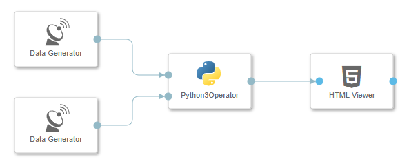

Your pipeline is ready, and you can save it by clicking the save button: 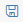 New window will open and you should populate it with details:

- Name: [choose your name – example: **my-chart-pipeline**]
- Description: [choose description – example: **My Chart Pipeline**]
- Category: [leave empty]

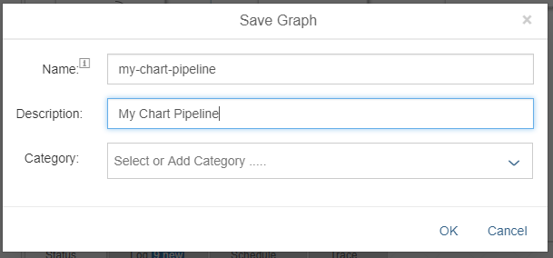

Finally, click the start button 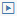 and your pipeline (my-chart-pipeline) will start. Now you can open your chart though **HTML Viewer** operator:

1) Left click on HTML Viewer operator to display the options on the right
2) Choose the first one Open UI

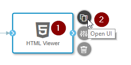

That’s it! We have reached our goal!

The chart should look like the one from the start of this blog:


---

### HTML Generator Details (Optional)

Let’s have a closer look into python code. It has one multi-line string field called html with the whole html definition. When the new point is received (in our case every 500ms) this **html** string field is changed, or more precisely the value **#points_\*** is changed and all together is propagated further to **HTML Viewer**.

```python
html = '''
<style>
  ...
</style>
<div class="graph-container"> 
  ...    
  <div class="chart-box">
    <svg viewBox="0 0 '''+str(chart_width)+''' '''+str(chart_height)+'''" class="chart">    
        ...
    
        #points_1
        #points_2
        
    </svg>
    ...
  </div>
</div>
'''
point = '''
<polyline fill="none" stroke="#chart_color" stroke-width="2"
    points="#x_start, #y_start, #x_end, #y_end"/>
'''
```
Here, the replacement of **#point_\*** string does the trick. I will focus only on that part and show the value of **#point_1** after each iteration (after each value arrival, every 500ms):

<table width="611">
<tbody>
<tr>
<td><strong>Iteration</strong></td>
<td style="text-align: left"><strong>#point_1 value</strong></td>
<td><strong>Visual Output</strong></td>
</tr>
<tr>
<td>1</td>
<td>
<pre class=" language-markup" style="max-width: 20em"><code class=" language-markup"><span class="token tag"><span class="token tag"><span class="token punctuation">&lt;</span>polyline</span> <span class="token attr-name">fill</span><span class="token attr-value"><span class="token punctuation">=</span><span class="token punctuation">"</span>none<span class="token punctuation">"</span></span> 
    <span class="token attr-name">stroke</span><span class="token attr-value"><span class="token punctuation">=</span><span class="token punctuation">"</span>#2E86C1<span class="token punctuation">"</span></span> 
    <span class="token attr-name">stroke-width</span><span class="token attr-value"><span class="token punctuation">=</span><span class="token punctuation">"</span>2<span class="token punctuation">"</span></span> 
    <span class="token attr-name">points</span><span class="token attr-value"><span class="token punctuation">=</span><span class="token punctuation">"</span>15, 289.0073049849775, 25, 238.24479285719343<span class="token punctuation">"</span></span><span class="token punctuation">&gt;</span></span>
<span class="token tag"><span class="token tag"><span class="token punctuation">&lt;/</span>polyline</span><span class="token punctuation">&gt;</span></span></code></pre>
</td>
<td style="text-align: center"></td>
</tr>
<tr>
<td style="text-align: left">2</td>
<td>
<pre class=" language-markup" style="max-width: 20em"><code class=" language-markup"><span class="token tag"><span class="token tag"><span class="token punctuation">&lt;</span>polyline</span> <span class="token attr-name">fill</span><span class="token attr-value"><span class="token punctuation">=</span><span class="token punctuation">"</span>none<span class="token punctuation">"</span></span> 
    <span class="token attr-name">stroke</span><span class="token attr-value"><span class="token punctuation">=</span><span class="token punctuation">"</span>#2E86C1<span class="token punctuation">"</span></span> 
    <span class="token attr-name">stroke-width</span><span class="token attr-value"><span class="token punctuation">=</span><span class="token punctuation">"</span>2<span class="token punctuation">"</span></span> 
    <span class="token attr-name">points</span><span class="token attr-value"><span class="token punctuation">=</span><span class="token punctuation">"</span>15, 289.0073049849775, 25, 238.24479285719343<span class="token punctuation">"</span></span><span class="token punctuation">&gt;</span></span>
<span class="token tag"><span class="token tag"><span class="token punctuation">&lt;/</span>polyline</span><span class="token punctuation">&gt;</span></span>
<span class="token tag"><span class="token tag"><span class="token punctuation">&lt;</span>polyline</span> 
    <span class="token attr-name">fill</span><span class="token attr-value"><span class="token punctuation">=</span><span class="token punctuation">"</span>none<span class="token punctuation">"</span></span> 
    <span class="token attr-name">stroke</span><span class="token attr-value"><span class="token punctuation">=</span><span class="token punctuation">"</span>#2E86C1<span class="token punctuation">"</span></span> 
    <span class="token attr-name">stroke-width</span><span class="token attr-value"><span class="token punctuation">=</span><span class="token punctuation">"</span>2<span class="token punctuation">"</span></span> 
    <span class="token attr-name">points</span><span class="token attr-value"><span class="token punctuation">=</span><span class="token punctuation">"</span>25, 238.24479285719343, 35, 298.2299842193816<span class="token punctuation">"</span></span><span class="token punctuation">&gt;</span></span>
<span class="token tag"><span class="token tag"><span class="token punctuation">&lt;/</span>polyline</span><span class="token punctuation">&gt;</span></span></code></pre>
</td>
<td style="vertical-align: top">&nbsp;</td>
</tr>
<tr>
<td style="text-align: left">3</td>
<td>
<pre class=" language-markup" style="max-width: 20em"><code class=" language-markup"><span class="token tag"><span class="token tag"><span class="token punctuation">&lt;</span>polyline</span> <span class="token attr-name">fill</span><span class="token attr-value"><span class="token punctuation">=</span><span class="token punctuation">"</span>none<span class="token punctuation">"</span></span> 
    <span class="token attr-name">stroke</span><span class="token attr-value"><span class="token punctuation">=</span><span class="token punctuation">"</span>#2E86C1<span class="token punctuation">"</span></span> 
    <span class="token attr-name">stroke-width</span><span class="token attr-value"><span class="token punctuation">=</span><span class="token punctuation">"</span>2<span class="token punctuation">"</span></span> 
    <span class="token attr-name">points</span><span class="token attr-value"><span class="token punctuation">=</span><span class="token punctuation">"</span>15, 289.0073049849775, 25, 238.24479285719343<span class="token punctuation">"</span></span><span class="token punctuation">&gt;</span></span>
<span class="token tag"><span class="token tag"><span class="token punctuation">&lt;/</span>polyline</span><span class="token punctuation">&gt;</span></span>
<span class="token tag"><span class="token tag"><span class="token punctuation">&lt;</span>polyline</span> 
    <span class="token attr-name">fill</span><span class="token attr-value"><span class="token punctuation">=</span><span class="token punctuation">"</span>none<span class="token punctuation">"</span></span> 
    <span class="token attr-name">stroke</span><span class="token attr-value"><span class="token punctuation">=</span><span class="token punctuation">"</span>#2E86C1<span class="token punctuation">"</span></span> 
    <span class="token attr-name">stroke-width</span><span class="token attr-value"><span class="token punctuation">=</span><span class="token punctuation">"</span>2<span class="token punctuation">"</span></span> 
    <span class="token attr-name">points</span><span class="token attr-value"><span class="token punctuation">=</span><span class="token punctuation">"</span>25, 238.24479285719343, 35, 298.2299842193816<span class="token punctuation">"</span></span><span class="token punctuation">&gt;</span></span>
<span class="token tag"><span class="token tag"><span class="token punctuation">&lt;/</span>polyline</span><span class="token punctuation">&gt;</span></span>
<span class="token tag"><span class="token tag"><span class="token punctuation">&lt;</span>polyline</span> 
    <span class="token attr-name">fill</span><span class="token attr-value"><span class="token punctuation">=</span><span class="token punctuation">"</span>none<span class="token punctuation">"</span></span> 
    <span class="token attr-name">stroke</span><span class="token attr-value"><span class="token punctuation">=</span><span class="token punctuation">"</span>#2E86C1<span class="token punctuation">"</span></span> 
    <span class="token attr-name">stroke-width</span><span class="token attr-value"><span class="token punctuation">=</span><span class="token punctuation">"</span>2<span class="token punctuation">"</span></span> 
    <span class="token attr-name">points</span><span class="token attr-value"><span class="token punctuation">=</span><span class="token punctuation">"</span>35, 298.2299842193816, 45, 281.13704792822426<span class="token punctuation">"</span></span><span class="token punctuation">&gt;</span></span>
<span class="token tag"><span class="token tag"><span class="token punctuation">&lt;/</span>polyline</span><span class="token punctuation">&gt;</span></span></code></pre>
</td>
<td style="vertical-align: top"></td>
</tr>
</tbody>
</table>

As you can see, every new arrival on input port creates new ```<polyline>``` html object and just append it to the previously created chain of ```<polyline>``` objects. With this technique, if someone is just looking at the screen, he will see only the difference or newly arrived value.

### More Examples

More examples with descriptions can be found on my github: https://github.com/stuparmihailo/blogs


|Line Charts:||
:---|:---:
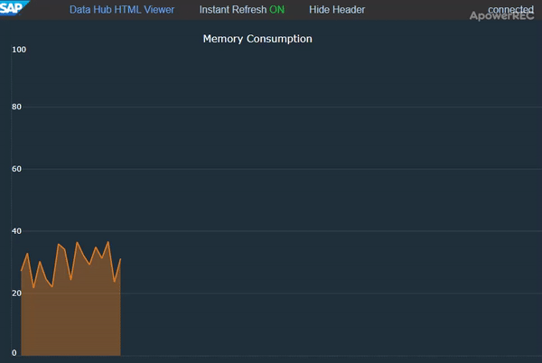  |  

|Scatter Plots:||
:---|:---:
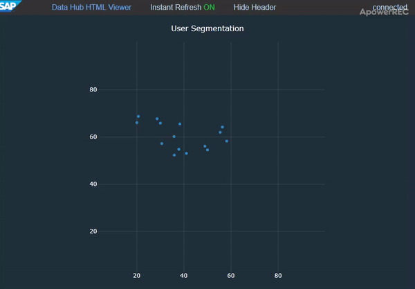  | 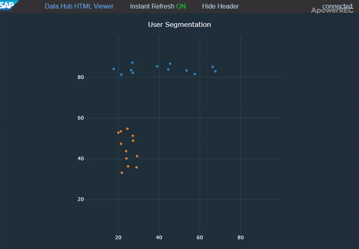 

|Map:|
:---|
| 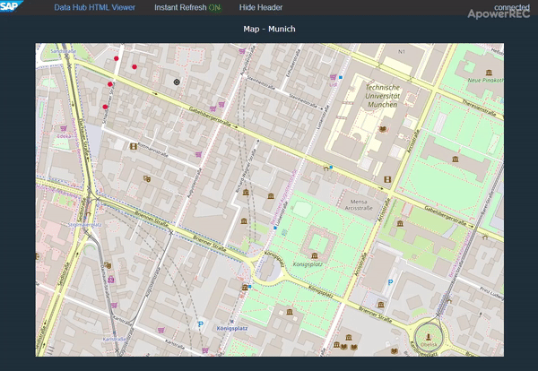  |
