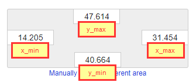

## Examples

This folder contains five examples that can be separated into three categories:
1) Line Charts
    - [Example 1 - Single Line Chart](#Example-1---Single-Line-Chart) 
    - [Example 2 - Multiple Line Chart](#Example-2---Multiple-Line-Chart) 
2) Scatter Plots 
    - [Example 3 - Single Cluster Scatter Plot](#Example-3---Single-Cluster-Scatter-Plot)
    - [Example 4 - Two Clusters Scatter Plot](#Example-4---Two-Clusters-Scatter-Plot)
3) Map Visualization 
    - [Example 5 - Map Visualization](#Example-5---Map-Visualization)

---

Explanation of each example follows the format.
1) Result (animated image)
2) Description
3) Pipeline
4) Code Examples
5) Appendix (Optional)

#### Example 1 - Single Line Chart
 


This type of chart is useful for displaying single input (single value). Entry point is just ```y value``` and in this case, ```y value``` is in range [20,40]. The code for generating such a value is in file [ex-1-generator.js](../examples/ex-1-generator.js). As shown in the diagram, there are no ```x values```. This is because, this diagram is timestamp oriented, which means every time the ```y value``` arrives, it is shown in the diagram (in our case it is generated every 500ms).

The code for html chart creation is in file [ex-1-line-plot-1.py](../examples/ex-1-line-plot-1.py). The code is more/less generic and external user should only be focused on ```configuratiom``` part.

```python
# CONFIGURATION
# --------------------------------------------------------------------------------------------
y_min = 0                           # minimum value displayed on y axis
y_max = 100                         # maximum value displayed on y axis (maximum must be greater (not greater or equal) than minimum)
input = "input1"                    # name of the input port
output = "output1"                  # name of the output port 
x_step = 10                         # distance in pixels on x axis between two consecutive values/measures (movement/shift to the right)
chart_height = 500                  # height of the chart in pixels 
chart_width = 1500                  # width of the chart in pixel
chart_color = "#E67E22"             # Color of the line/chart. blue = 2E86C1, yellow = F4D03F, orange = E67E22
num_y_labels = 4                    # number of labels dispyed on y axes. y_min and y_max values are displayed by default on y axis. Total number of labels is num_y_labels + 2 
y_label_decimals = 0                # number of decimal places used for displaying labels on y axis - 0 means, integers are displayed
graph_name = "Memory Consumption"   # title/graph name
# -------------------------------------------------------------------------------------------
```

All components mentioned above are part of the diagram:
the diagram looks as follows:


---

#### Example 2 - Multiple Line Chart


If two values should be displayed in a single diagram, than this type of chart can be used. It accepts two values from two input port and displayes it simultaniously. ```y value``` generators can be found in files [ex-2-1-generator.js](../examples/ex-2-1-generator.js) and [ex-2-2-generator.js](../examples/ex-2-2-generator.js). They are connected to single python component which generates html with the chart. Python code can be found in [ex-2-line-plot-2.py](../examples/ex-2-line-plot-2.py) with coresponding ```configuration```:

```python
# CONFIGURATION
# --------------------------------------------------------------------------------------------
y_min = 0                           # minimum value displayed on y axis
y_max = 100                         # maximum value displayed on y axis (maximum must be greater (not greater or equal) than minimum)
inputs = ["input1","input2"]        # name of the input ports
output = "output"                   # name of the output port 
chart_colors = ["#2E86C1","#E67E22"]# chart colors. First element in chart_colors array matches the first value in inputs array. blue = 2E86C1 , yellow = F4D03F, orange = E67E22
x_step = 10                         # distance in pixels on x axis between two consecutive values/measures (movement/shift ti the right)
chart_height = 500                  # height of the chart in pixels 
chart_width = 1500                  # width of the chart in pixel
num_y_labels = 4                    # number of labels dispyed on y axes. y_min and y_max values are displayed by default on y axis. Total number of labels is num_y_labels + 2 
y_label_decimals = 0                # number of decimal places used for displaying labels on y axis - 0 means, integers are displayed
graph_name = "Resource Consumption" # title/graph name
input_names = ["cpu", "memory"]     # 
# -------------------------------------------------------------------------------------------
```
Finally, the diagram looks as follows:


---

#### Example 3 - Single Cluster Scatter Plot


Sometimes, data are organized in clusters and it can be useful to represent them. This example represents single point (single input) in 2D coordinate system.

Altough, the python script that generates html accepts two inputs, semantically they represent one point with two coordinates. First generator [ex-3-1-generator.js](../examples/ex-3-1-generator.js) generates ```x-value``` and second one [ex-3-2-generator.js](../examples/ex-3-2-generator.js) is responsible for ```y value```.

Then, html creator merges these two inputs and creates single html file (output), which is described in [ex-3-scatter-plot-1.py](../examples/ex-3-scatter-plot-1.py). ```Configuration``` is listed at the begining of the file:
```python
# CONFIGURATION
# --------------------------------------------------------------------------------------------
y_min = 0                           # minimum value displayed on y axis
y_max = 100                         # maximum value displayed on y axis (maximum must be greater (not greater or equal) than minimum)
x_min = 0                           # minimum value displayed on x axis
x_max = 100                         # maximum value displayed on x axis (maximum must be greater (not greater or equal) than minimum)
inputs = ["input1","input2"]        # name of the input ports. It cooresponds to x and y axis
output = "output"                   # name of the output port 
chart_color = "#2E86C1"             # point chart color. blue = 2E86C1 , yellow = F4D03F, orange = E67E22
chart_height = 500                  # height of the chart in pixels 
chart_width = 500                   # width of the chart in pixel
num_y_labels = 4                    # number of labels dispyed on y axis. min and max values are not displayed 
num_x_labels = 4                    # number of labels dispyed on x axis. min and max values are not displayed
label_decimals = 0                  # number of decimal places used for displaying labels on y axis.label_decimals = 0 -> integers are displayed
graph_name = "User Segmentation"    # title/graph name
# -------------------------------------------------------------------------------------------
```
At the end, the the look of the pipeline is shown in image below.


---

#### Example 4 - Two Clusters Scatter Plot


This graph is very similiar as the previous one (with a single input). It shows in the same time two clusters marked with different color. Generator scripts [ex-4-1-generator.js](../examples/ex-4-1-generator.js) and  [ex-4-2-generator.js](../examples/ex-4-2-generator.js). Each one is responsible for creation of two coordinates (x,y) for a point in a single cluster. Two scripts means two clusters, as shown in image above.

Python script that converts these two points into html is [ex-4-scatter-plot-2.py](../examples/ex-4-scatter-plot-2.py). It accepts two csv encoded strings (i.e. ```40.1,20.3``` where ```x=40.1``` and ```y=20.3```).  ```Configuration``` of this script is:
```python
# CONFIGURATION
# --------------------------------------------------------------------------------------------
y_min = 0                           # minimum value displayed on y axis
y_max = 100                         # maximum value displayed on y axis (maximum must be greater (not greater or equal) than minimum)
x_min = 0                           # minimum value displayed on x axis
x_max = 100                         # maximum value displayed on x axis (maximum must be greater (not greater or equal) than minimum)
inputs = ["input1","input2"]        # name of the input ports. input1 contains x,y (coordinates) for first type of dots. input2 for represents x,y for second type of dots. Inputs must be csv formated: float,float
output = "output"                   # name of the output port 
chart_colors = ["#2E86C1","#E67E22"]# point chart colors/dot colors. blue = 2E86C1 , yellow = F4D03F, orange = E67E22
chart_height = 500                  # height of the chart in pixels 
chart_width = 500                   # width of the chart in pixel
num_y_labels = 4                    # number of labels dispyed on y axis. min and max values are not displayed 
num_x_labels = 4                    # number of labels dispyed on x axis. min and max values are not displayed
label_decimals = 0                  # number of decimal places used for displaying labels on y axis - 0 means, integers are displayed
graph_name = "User Segmentation"    # title/graph name
# -------------------------------------------------------------------------------------------
```
Again, all components together look:


---

#### Example 5 - Map Visualization


The prereuqisite for this type of visualization is to create the map image which will be served as background. For this purpose, [Open Street Map](https://www.openstreetmap.org/) is used. 

**How to Generate png image from [Open Street Map](https://www.openstreetmap.org/)**

1) Go to the link and click **Export** button [1] in top left corner. Rectangle with 4 values will be shown.[2]<br>


2) Remember 4 values from image below because they will be used as configuration parameters in python script [ex-5-map-plot.py](../examples/ex-5-map-plot.py) <br>


3) Bar on the right side contains **Share** button [1]. Click on it and then select optionally check box [2] which will create big recatngle in midle of the map. This is the crop of the map which will be download. Make sure that format is PNG [3]. Finally, download the image. [4]<br>*Note: Do not touch **Scale 1** property*<br> 


4) Label with text **Image will show standard layer at Width x Height** contains two values important for python script configuration. <br>


5) Publish downloaded image to some public url. It will be used from the html as background of the plot. In this example, map image is served from https://raw.githubusercontent.com/stuparmihailo/blogs/dev/city-map.png 


After all these steps, neccesary configuration params for html generator are defined. They should be part of [ex-5-map-plot.py](../examples/ex-5-map-plot.py) configuration header

```python
# CONFIGURATION
# --------------------------------------------------------------------------------------------
y_min = 48.14430                    # minimum value displayed on y axis (min latitude)
y_max = 48.15026                    # maximum value displayed on y axis (max latitude)
x_min = 11.55723                    # minimum value displayed on x axis (min longitude)
x_max = 11.57143                    # maximum value displayed on x axis (max longitude)
inputs = "input1"                   # name of the input port. It cooresponds to longitude,latitude. Important that longitude is first value
output = "output"                   # name of the output port 
chart_color = "#DC143C"             # point chart color. blue = 2E86C1 , yellow = F4D03F, orange = E67E22, red = DC143C
chart_height = 652                  # height of the chart in pixels 
chart_width = 975                   # width of the chart in pixel
graph_name = "Map - Munich"         # title/graph name
map_url="https://raw.githubusercontent.com/stuparmihailo/blogs/dev/city-map.png"    #url with location of the map
# -------------------------------------------------------------------------------------------
```

GPS coordinates are generated in [ex-5-generator.js](../examples/ex-5-generator.js). It creates csv formatted string with two float values ```longiutde,latitude```. It is very important that longitude is the first value in generated string.

Finaly, the whole diagram looks as follows:


