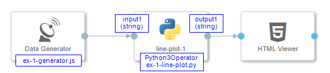

## Example 1

#### 1 - Result

<p align="center"></p>

#### 2 - Description

Accepts a single value as input (string formatted float or integer) and shows it in diagram as changed ```y``` value. The chart updates the look on every value arrival. 

#### 3 - Pipeline

<p align="center"></p>

#### 4 - Code Examples

- [ex-1-generator.js](./ex-1-generator.js)
- [ex-1-line-plot-1.py](./ex-1-line-plot-1.py)
 
