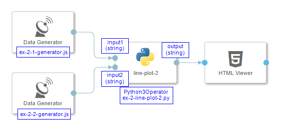

## Example 2

#### 1 - Result

<p align="center"></p>

#### 2 - Description

Accepts two values as inputs (string formatted floats or integers) and shows them in diagram as changed ```y``` values. The chart updates the look on every values arrival. 

#### 3 - Pipeline

<p align="center"></p>

#### 4 - Code Examples

- [ex-2-1-generator.js](./ex-2-1-generator.js)
- [ex-2-2-generator.js](./ex-2-2-generator.js)
- [ex-2-line-plot-2.py](./ex-2-line-plot-2.py)
 
