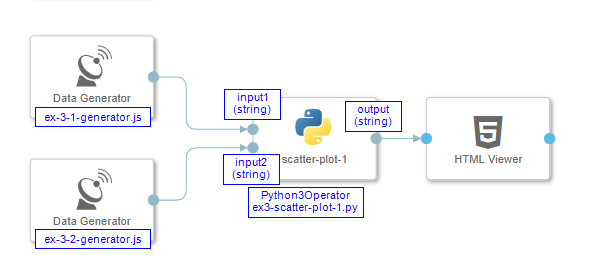

## Example 3

#### 1 - Result

<p align="center"></p>

#### 2 - Description

Accepts two values as inputs (string formatted floats or integers) that represent ```x``` and ```y``` coordinate. Single dot is placed on position ```(x,y)```. All drawn dots belong to same cluster.

#### 3 - Pipeline

<p align="center"></p>

#### 4 - Code Examples

- [ex-3-1-generator.js](./ex-3-1-generator.js)
- [ex-3-2-generator.js](./ex-3-2-generator.js)
- [ex-3-scatter-plot-1.py](./ex-3-scatter-plot-1.py)
 
