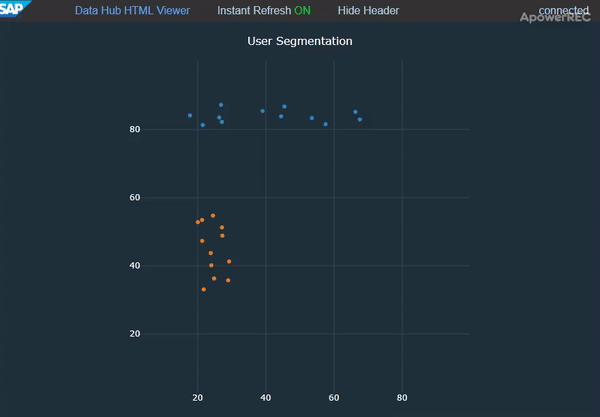

## Example 4

#### 1 - Result

<p align="center"></p>

#### 2 - Description

Accepts two values as inputs (each input as a single cluster). Single input is csv formatted string, for example: ```12.0,33.1``` where first value represents ```x``` coordinate and second value ```y``` coordinate.

#### 3 - Pipeline

<p align="center"></p>

#### 4 - Code Examples

- [ex-4-1-generator.js](./ex-4-1-generator.js)
- [ex-4-2-generator.js](./ex-4-2-generator.js)
- [ex-4-scatter-plot-2.py](./ex-4-scatter-plot-2.py)
 
