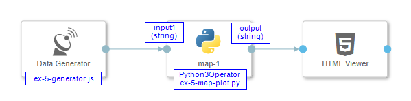
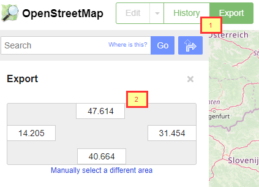
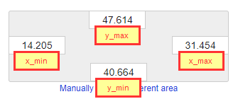
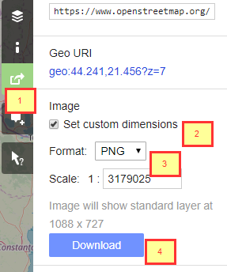
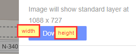

## Example 5

#### 1 - Result

<p align="center"></p>

#### 2 - Description

Accepts single input that represents single gps coordinate. Input is csv formatted string in form ```longitude,latitude```, for example ```22.46841,11.35124```. Every new input arrival, represents new gps point drawn in the map.

Prerequisite for this kind of chart is creation of map background image. Steps to create such an image are explained in Appendix.

#### 3 - Pipeline

<p align="center"></p>

#### 4 - Code Examples

- [ex-5-generator.js](./ex-5-generator.js)
- [ex-5-map-plot.py](./ex-5-map-plot.py)

#### 5 - Appendix

1) Go to the [Open Street Map](https://www.openstreetmap.org/), find the area that you want to display and click **Export** button [1] in top left corner. Rectangle with 4 values will be shown.[2]
<p align="center"></p>


2) Remember 4 values from image below because they will be used as **Configuration** parameters in python script [ex-5-map-plot.py](../ex-5-map-plot.py)
<p align="center"></p>

3) Bar on the right side contains **Share** button [1]. Click on it and then select optionally check box [2] which will create big recatngle in midle of the map. This is the crop of the map which will be download. Make sure that format is PNG [3]. Finally, download the image. [4]<br>*Note: Do not touch **Scale 1** property*<br> 
<p align="center"></p>

4) Label with text **Image will show standard layer at Width x Height** contains two values important for python script configuration. 
<p align="center"></p>

5) Publish downloaded image to some public url. It will be used from the html as background of the plot. Copy this url to the **Configuration** part of your python script. <br>In this example, map image is served from https://raw.githubusercontent.com/stuparmihailo/blogs/dev/city-map.png 
